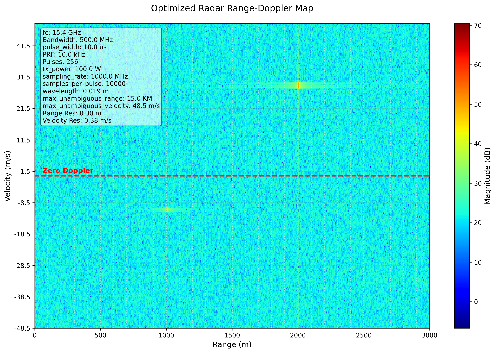
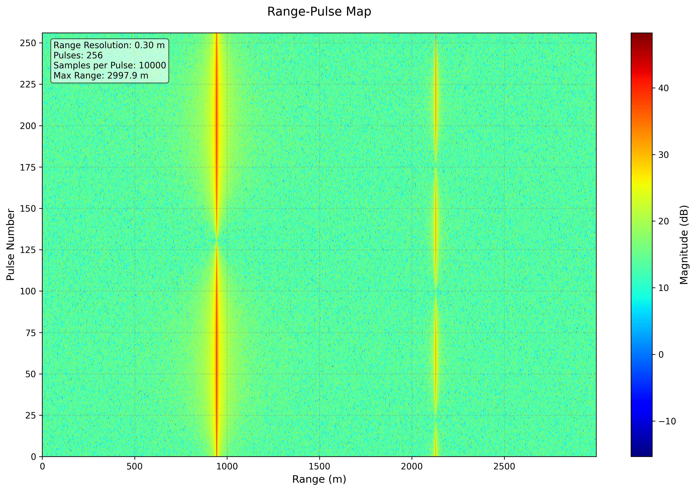
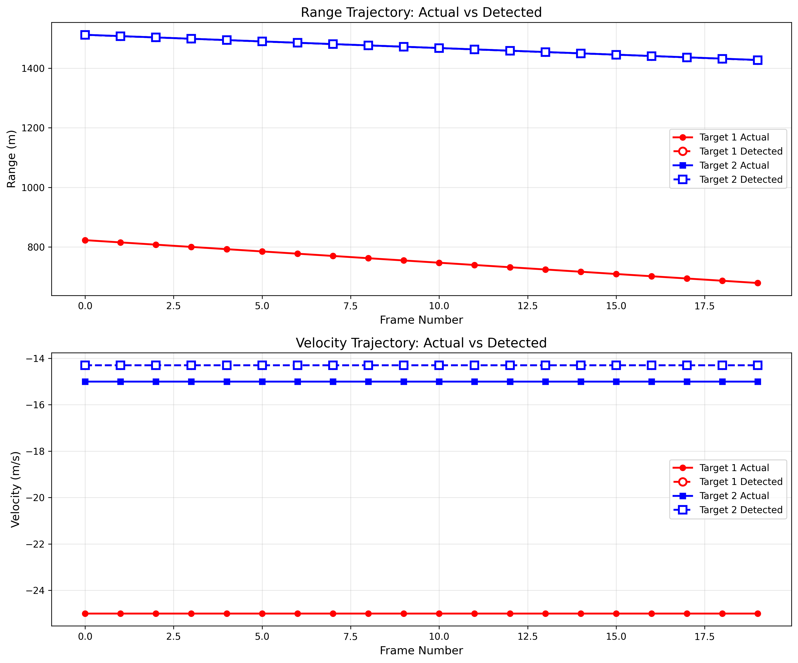
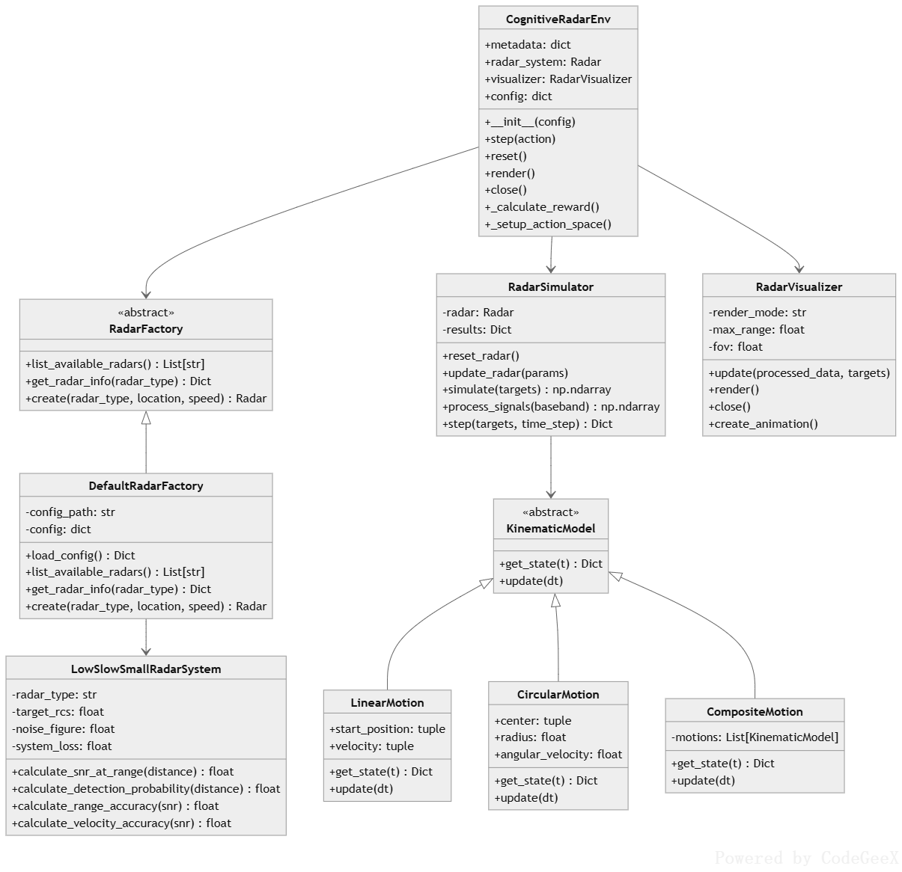
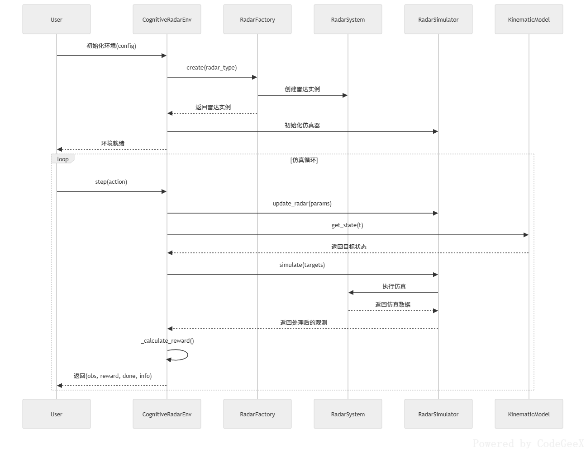
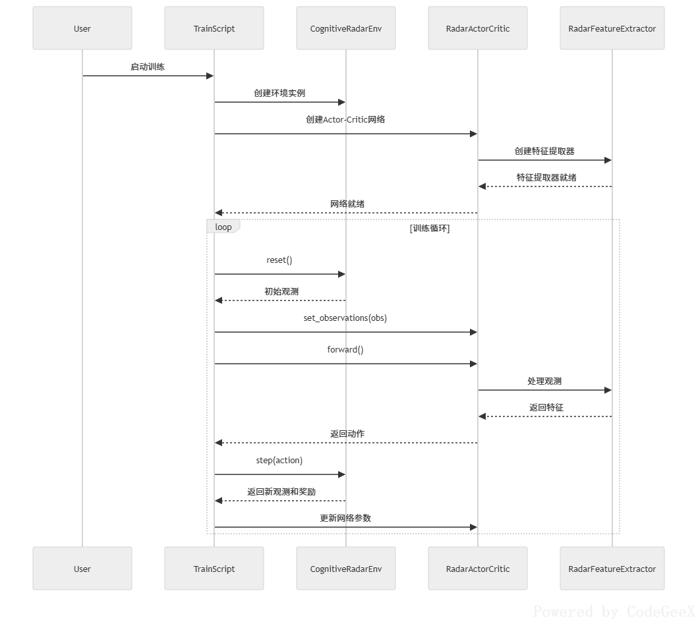
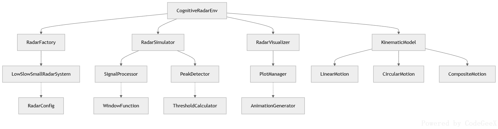

# 长城数字认知雷达系统 (Cognitive Radar System)

[](https://www.python.org/downloads/)
[](LICENSE)
[](https://github.com/psf/black)

## 简介

认知雷达系统是一个基于深度学习的智能雷达仿真与训练平台，专门针对低慢小目标（如无人机、鸟类等）的探测与跟踪。该系统通过强化学习算法实现雷达参数的自适应优化，提高目标检测性能。

## 关键特性

- 🎯 **智能认知雷达**：基于强化学习的自适应雷达系统
- 📊 **多种雷达类型**：支持10种不同配置的专业雷达系统
- 🎮 **多种训练算法**：支持PPO、RSL-RL等多种强化学习算法
- 📈 **完整仿真环境**：包含目标运动模型、杂波模拟、传播模型等
- 🎨 **可视化工具**：提供距离-多普勒图、航迹图等多种可视化功能
- 🔧 **模块化设计**：高度可扩展的架构，支持自定义雷达和目标模型

## 1. 雷达系统仿真

### 1.1 雷达参数配置
- **多类型雷达支持**：实现10种不同配置的专业雷达系统
  - PD-LS01 (X波段基础型)
  - PD-LS02 (Ku波段便携式)
  - PD-LS03 (Ku波段城市监控)
  - PD-LS04 (L波段长程预警)
  - PD-LS05 (C波段反无人机)
  - PD-LS06 (S波段海岸监视)
  - PD-LS07 (S波段低功耗)
  - PD-LS08 (X波段机场监控)
  - PD-LS09 (C波段战术雷达)
  - PD-LS10 (Ka波段微型探测)

### 1.2 雷达信号处理
- **信号生成与处理**：
  - 脉冲压缩
  - MTI滤波
  - 多普勒处理
  - 峰值检测
- **性能计算**：
  - 信噪比(SNR)计算
  - 检测概率评估
  - 距离/速度精度计算
  - 杂波抑制分析

## 2. 目标运动仿真

### 2.1 运动模型
- **基础运动模型**：
  - 静态模型 (StaticModel)
  - 匀速直线运动 (LinearMotion)
  - 圆周运动 (CircularMotion)
  - 振动运动 (VibrationMotion)
- **复合运动模型**：
  - 复合运动 (CompositeMotion)
  - 轨迹运动 (TrajectoryMotion)
  - 相位锁定运动 (PhaseLockedMotion)

### 2.2 目标管理
- **场景管理器** (ScenarioManager)：
  - 目标调度与创建
  - 状态更新与跟踪
  - 多目标协同运动
  - 目标生命周期管理

## 3. 环境仿真

### 3.1 传播模型
- **自由空间传播** (FreeSpacePropagation)
- **地形感知传播** (TerrainAwarePropagation)
  - 地形损耗计算
  - 植被衰减评估
  - 大气衰减建模

### 3.2 杂波仿真
- **杂波模型**：
  - 常数杂波模型 (ConstantClutterModel)
  - 经验杂波模型 (EmpiricalClutterModel)
- **杂波特性**：
  - 杂波RCS计算
  - 杂波地图生成
  - 海杂波/地杂波模拟

## 4. 可视化功能

### 4.1 实时显示
- **雷达显示**：
  - 距离-多普勒图(RD Map)
  - 距离-脉冲图
  - 3D RD图显示
- **目标显示**：
  - 2D/3D轨迹显示
  - 波束覆盖范围
  - 多目标跟踪显示

### 4.2 数据分析
- **性能分析**：
  - 检测性能指标
  - 轨迹对比分析
  - 信号强度分布
- **动画生成**：
  - RD图动画
  - 轨迹动画
  - 实时数据流显示

## 5. 强化学习环境

### 5.1 环境接口
- **标准Gym接口**：
  - 动作空间配置
  - 观测空间定义
  - 奖励函数设计
- **多环境支持**：
  - 向量化环境
  - 并行训练支持
  - 异步环境更新

### 5.2 训练功能
- **算法支持**：
  - PPO算法
  - RSL-RL算法
- **训练管理**：
  - 模型保存/加载
  - 训练进度监控
  - 性能评估

## 6. 仿真工具

### 6.1 信号处理工具
- **窗函数比较**：
  - Hamming窗
  - Hanning窗
  - Blackman窗
- **特征提取**：
  - RD图特征
  - 目标特征
  - 杂波特征
- **信号处理图**：
  - 距离-多普勒图
  
  - 距离-脉冲图
  
  - 航迹关联图
  

### 6.2 性能分析工具
- **检测性能**：
  - ROC曲线
  - 检测概率曲线
  - 虚警率分析
- **系统性能**：
  - 最大探测距离
  - 测量精度
  - 抗干扰能力

## 安装指南

### 环境要求

- Python 3.8+
- PyTorch 1.10+
- Stable Baselines3
- RSL-RL
- RadarSimPy

### 安装步骤

1. 克隆仓库：
```bash
git clone https://github.com/yourusername/cognitive_radar_system.git
cd cognitive_radar_system
```

2. 创建虚拟环境：
```bash
python -m venv radar_env
source radar_env/bin/activate  # Linux/Mac
# 或
radar_env\Scripts\activate  # Windows
```

3. 安装依赖：
```bash
pip install -r requirements.txt
```

## 快速开始

### 基本使用

1. 训练模型：
```bash
python scripts/rsl_rl/train_.py --train --config assets/configs/radar/radar_config.yml
```

2. 评估模型：
```bash
python scripts/rsl_rl/train_.py --eval path/to/model.pth --config assets/configs/radar/radar_config.yml
```

### 示例代码

```python
from cognitive_radar.environment import CognitiveRadarEnv
from cognitive_radar.radar_system import DefaultRadarFactory

# 创建雷达
factory = DefaultRadarFactory()
radar = factory.create("PD-LS02")

# 创建环境
env = CognitiveRadarEnv({
    "radar_type": "PD-LS05",
    "max_steps": 1000
})

# 运行仿真
obs = env.reset()
for _ in range(1000):
    action = env.action_space.sample()
    obs, reward, done, info = env.step(action)
    if done:
        obs = env.reset()
```

## 项目结构

```
cognitive_radar_system/
├── assets/                 # 资源文件
│   ├── configs/           # 配置文件
│   ├── models/           # 3D模型
│   └── trajectories/     # 轨迹文件
├── src/cognitive_radar/  # 源代码
│   ├── environment/      # 环境模型
│   ├── radar_system/    # 雷达系统
│   ├── motion_models/   # 运动模型
│   ├── train/          # 训练脚本
│   └── utils.py        # 工具函数
├── scripts/             # 训练和评估脚本
├── tests/              # 测试代码
└── docs/              # 文档
```

## 支持的雷达类型

| 型号 | 类型 | 频段 | 特点 |
|------|------|------|------|
| PD-LS01 | 基础型低空监视 | X波段 | 自适应MTI滤波 |
| PD-LS02 | 机动型便携 | Ku波段 | 快速部署 |
| PD-LS03 | 高分辨率城市监控 | Ku波段 | 多径抑制 |
| PD-LS04 | 长程低空预警 | L波段 | 气象杂波抑制 |
| PD-LS05 | 反无人机专用 | C波段 | 微多普勒识别 |
| PD-LS06 | 海岸监视 | S波段 | 海杂波抑制 |
| PD-LS07 | 低功耗边境巡逻 | S波段 | 太阳能供电 |
| PD-LS08 | 机场跑道监控 | X波段 | ICAO标准 |
| PD-LS09 | 多功能战术 | C波段 | SAR成像 |
| PD-LS10 | 微型无人机探测 | Ka波段 | 深度学习分类 |

## 训练算法

### 支持的算法和训练框架

- **PPO** (Proximal Policy Optimization)
- **Stable baseine 3**
- **RSL-RL** (Robotic Systems Lab - Reinforcement Learning)

### 训练配置

训练参数在 `assets/configs/radar/radar_config.yml` 中配置：

```yaml
training:
  algorithm: ppo
  learning_rate: 3e-4
  batch_size: 128
  num_envs: 4
  save_interval: 100
```

## UML

### 类图



### 主序列图


### 训练序列图



### 协作图



## 贡献者

- [ten2net](https://github.com/ten2net)


## 贡献指南

我们欢迎任何形式的贡献！请遵循以下步骤：

1. Fork 本仓库
2. 创建特性分支 (`git checkout -b feature/AmazingFeature`)
3. 提交更改 (`git commit -m 'Add some AmazingFeature'`)
4. 推送到分支 (`git push origin feature/AmazingFeature`)
5. 创建 Pull Request

### 开发规范

- 使用 Black 进行代码格式化
- 遵循 PEP 8 规范
- 编写单元测试
- 更新文档

## 许可证

本项目采用 MIT 许可证 - 详见 [LICENSE](LICENSE) 文件。

## 致谢

感谢所有贡献者和以下开源项目：

- [RadarSimPy](https://github.com/caesarradar/RadarSimPy)
- [Stable Baselines3](https://github.com/DLR-RM/stable-baselines3)
- [RSL-RL](https://github.com/leggedrobotics/rsl_rl)

## 联系方式

- 项目链接：[https://github.com/ten2net/cc_cognitive_radar_system](https://github.com/ten2net/cc_cognitive_radar_system)
- 问题反馈：[Issues](https://github.com/ten2net/cognitive_radar_system/issues)
- 邮箱：ten2net@163.com

## 更新日志

### v0.0.1 (2025-09-03)
- 初始版本发布
- 支持10种雷达类型
- 实现PPO和RSL-RL训练算法
- 添加完整的仿真环境

